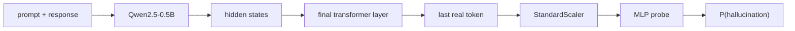

# SMILES-2026 Hallucination Detection

Hidden-state probing solution for detecting hallucinated answers generated by
`Qwen/Qwen2.5-0.5B`.


## Executive Summary

This repository contains a reproducible solution for the SMILES-2026
hallucination detection task. The goal is to classify whether an LLM response is
truthful (`0`) or hallucinated (`1`) using the model's internal hidden states.

The final model is intentionally compact and robust:

- representation: final transformer layer of `Qwen/Qwen2.5-0.5B`
- aggregation: last real token from the `prompt + response` sequence
- probe: one-hidden-layer MLP with `StandardScaler`
- class imbalance: handled with `BCEWithLogitsLoss(pos_weight=...)`
- random seed: fixed default seed `19`
- final feature dimension: `896`

The final fixed-seed run improved the official skeleton baseline:

| Model | Feature Dim | Test-Split Accuracy | Test-Split F1 | Test-Split AUROC |
|---|---:|---:|---:|---:|
| official skeleton baseline | 896 | 0.7404 | 0.8302 | 0.7366 |
| final fixed-seed MLP probe | 896 | 0.7500 | 0.8375 | 0.7371 |

The research process also tested multi-layer probing, layer-wise ablations,
trajectory stability features, EigenScore-inspired spectral features, boosting,
class-imbalance variants, and seed ensembles. Those experiments are documented
in [SOLUTION.md](SOLUTION.md), [EXPERIMENTS.md](EXPERIMENTS.md), and
[DATA_ANALYSIS.md](DATA_ANALYSIS.md).

## Method



The final representation uses the hidden state of the last non-padding token in
the final transformer layer. This token is a compact summary of the full
context and generated answer. On this small dataset, larger feature sets
improved research coverage but did not improve the primary metric reliably.

## Repository Structure

```text
.
|-- aggregation.py       # hidden-state aggregation; final layer + last token
|-- probe.py             # HallucinationProbe MLP classifier
|-- splitting.py         # seeded stratified train/validation/test split
|-- solution.py          # fixed official runner; generates outputs
|-- evaluate.py          # fixed official evaluation utilities
|-- model.py             # fixed Qwen loader
|-- data/
|   |-- dataset.csv      # labelled training/evaluation data
|   `-- test.csv         # unlabelled submission data
|-- SOLUTION.md          # final method, metrics, reproducibility
|-- EXPERIMENTS.md       # full ablation and research log
|-- DATA_ANALYSIS.md     # exploratory data analysis
`-- requirements.txt
```

Only the participant-editable code files were changed:

- `aggregation.py`
- `probe.py`
- `splitting.py`

The fixed infrastructure files `solution.py`, `model.py`, and `evaluate.py`
were left unchanged.

## Quick Start

Recommended runtime: Google Colab or Kaggle Notebook with a GPU.

```bash
git clone https://github.com/mart1ny/summer-school-application-china.git
cd summer-school-application-china
pip install -r requirements.txt
python solution.py
```

The script loads `Qwen/Qwen2.5-0.5B`, extracts hidden states, trains the probe,
runs the official evaluation, and writes:

- `results.json`
- `predictions.csv`

## Final Artifacts

This repository includes the final artifacts generated by the official runner:

| File | Description |
|---|---|
| `results.json` | official evaluation output for the final fixed-seed run |
| `predictions.csv` | predictions for `data/test.csv` with columns `id,label` |

Final artifact summary:

- `feature_dim`: `896`
- `avg_test_accuracy`: `0.7500`
- `avg_test_f1`: `0.8375`
- `avg_test_auroc`: `0.7371`
- `predictions.csv`: `100` predictions, `31` truthful and `69` hallucinated

For an existing Colab checkout:

```bash
cd /content/summer-school-application-china
git checkout main
git pull origin main
pip install -r requirements.txt
python solution.py
```

## Reproducibility

The final seed is fixed in `probe.py`:

```python
DEFAULT_PROBE_SEED = 19
```

For additional seed experiments, override it without editing code:

```bash
PROBE_SEED=7 python solution.py
```

No local paths, test-label access, external training data, or extra dependencies
are required.

## Dataset

`data/dataset.csv` contains 689 labelled samples:

| Label | Meaning | Count |
|---:|---|---:|
| `0` | truthful | 206 |
| `1` | hallucinated | 483 |

`data/test.csv` contains 100 unlabelled samples. Running `solution.py` produces
`predictions.csv` with columns:

| Column | Description |
|---|---|
| `id` | row id from `data/test.csv` |
| `label` | predicted class, `0` or `1` |

## Research Highlights

The final solution was selected after controlled ablations:

- Layer-wise probing found that the hallucination signal is present across
  several layers, but the final-layer MLP remained strongest for accuracy.
- Multi-layer pooling increased feature dimension but overfit the small
  labelled set.
- Trajectory and spectral covariance features were useful research probes but
  did not improve the official metric.
- Data analysis showed strong class imbalance and response-length/overlap
  correlations, but raw text features were not used in the final model to keep
  the solution aligned with hidden-state probing.
- Seed search showed that the original compact representation with a fixed MLP
  seed was the most reliable final choice.

## Leakage and Rule Compliance

- No labels from `data/test.csv` are used.
- No hardcoded examples, response strings, or local paths are used.
- The final prediction file is generated only by `solution.py`.
- All splits are stratified and seeded.
- The solution is self-contained and uses only dependencies in
  `requirements.txt`.
- The fixed infrastructure files remain unchanged.

## Submission Notes

The application form expects:

1. a GitHub repository link;
2. a publicly available `predictions.csv`;
3. `results.json` produced by `python solution.py`;
4. a Markdown report, provided here as [SOLUTION.md](SOLUTION.md).

For the final submission, run `python solution.py` in Colab, then upload the
generated `predictions.csv` to public cloud storage and keep `results.json`
with the run artifacts.
